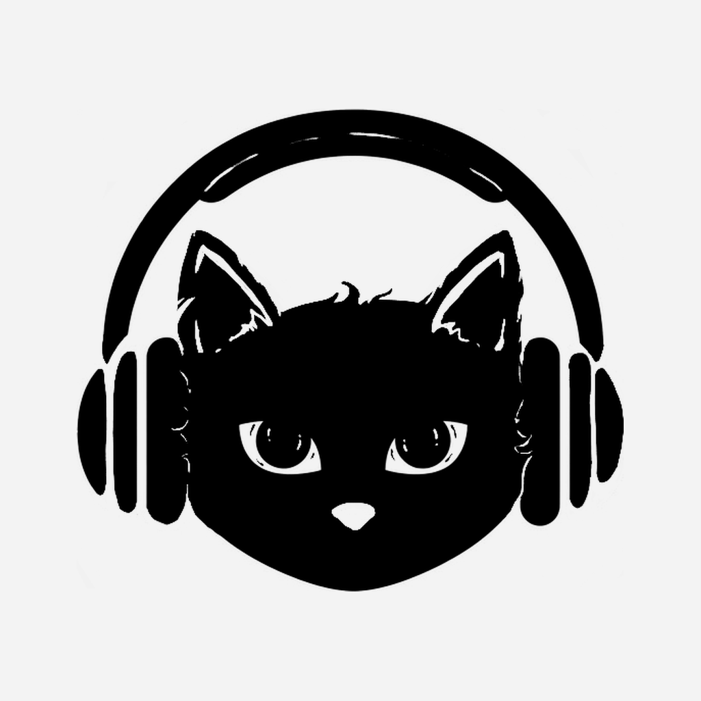

<p align="center"></p>

# RiffPlayer

A self-hosted music server with a polished first-party web client, native mobile apps, and full Subsonic API compatibility. Stream your own music library from anywhere — use RiffPlayer's built-in web app, the Flutter iOS/Android app, or any Subsonic-compatible client (Amperfy, Symfonium, DSub, Feishin, …).

## Screenshots

| | |
|---|---|
|  |  |
|  |  |

<details>
<summary>Login</summary>


</details>

## Features

### Server
- **Subsonic / OpenSubsonic API** — drop-in replacement for Navidrome, Airsonic, etc.; any Subsonic client works unchanged
- **Library indexing** — walks your music folder, reads tags via `music-metadata`, upserts artists/albums/tracks into SQLite; re-scans skip unchanged files
- **Streaming** — serves originals or transcodes on the fly with ffmpeg (MP3, AAC, Opus, OGG, FLAC); HTTP range requests for seeking
- **Per-user transcode settings** — each user can set a preferred format and bitrate cap (useful for mobile data)
- **ReplayGain** — reads RG tags during indexing; applies `-af volume=XdB` via ffmpeg when transcoding
- **Cover art pipeline** — embedded art → Cover Art Archive (via MusicBrainz release MBID) → manual upload; cached to disk
- **Synced lyrics** — `getLyricsBySongId` (OpenSubsonic): checks `.lrc` sidecar files, then LRCLIB API; caches in DB
- **Play history** — every play logged from day one (`play_history` table); feeds recently-played, most-played, recommendations, and Wrapped
- **Scrobbling** — Last.fm (with proper `api_sig` signing) and ListenBrainz, opt-in per-user; fires after confirmed plays
- **JWT authentication** — `POST /api/v1/auth/login` issues a 90-day token; `/api/v1` routes accept Bearer JWT with Subsonic token fallback

### Web client
- **React + TypeScript PWA** — installable, responsive, dark-themed
- **Library browse** — albums grid (sort by newest / recently played / most played / starred / A–Z / random), artist index, album and artist detail pages
- **Search** — finds artists, albums, and songs simultaneously
- **Queue management** — add tracks, drag-to-reorder (@dnd-kit), remove, clear; persistent across navigation
- **Player** — HTML5 audio, play/pause/next/prev, seek bar, volume; applies ReplayGain gain offset to `audio.volume`
- **Synced lyrics panel** — slide-in overlay with per-line time sync and auto-scroll; toggled from the player bar
- **Favourites** — star/unstar tracks, albums, and artists; dedicated Favourites page
- **Playlists** — create, rename, delete, drag-to-reorder tracks, upload custom cover image
- **Recently played + most played** — backed by `play_history` via `getAlbumList2?type=recent/frequent`
- **Admin panel** — manage users (create, change password/role, delete), music libraries (add path, trigger scan, remove), and server settings
- **User settings** — per-user transcoding preferences, ListenBrainz token, Last.fm session key
- **Discover / recommendations** — opt-in; similar-artist picks from Last.fm or fully local AI via Ollama; only suggests tracks already in your library, never external links
- **Year-end Wrapped** — top tracks, artists, albums, total hours, plays-by-month chart; optional Ollama AI narrative summary
- **Media Session API** — lock-screen metadata and transport controls in supported browsers
- **Workbox service worker** — cover art cached for offline browsing

### Mobile (Flutter — iOS + Android)
- **Background playback** with lock-screen controls and skip shortcuts (`audio_service` + `just_audio`)
- **Offline downloads** — stores originals on device (Dio + SQLite); played from local file when available
- **Full parity** with web: browse, search, queue, playlists, favourites
- **Full-screen player** with seek slider, star/unstar, prev/play/next
- **Per-tab navigation** with persistent mini-player across all screens

### Infrastructure
- **Multi-user** — each user has their own play history, favourites, playlists, and scrobbling config; admin manages everything
- **Docker** — three-stage build (web → server → runtime); `RIFFPLAYER_ADMIN_PASSWORD` configurable before first boot; serves web app statically from the same port
- **SQLite** — single-file database, zero external dependencies; WAL mode; full migration history

## Install

RiffPlayer has two parts: a **server** you run on your own machine (it serves your music files and the web app), and **apps** that connect to it.

### 1. Run the server (Docker)

Create a `docker-compose.yml`:

```yaml
services:
  riffplayer:
    image: ghcr.io/atabayrak460-sys/riffplayer:latest
    ports:
      - "4533:4533"
    # Optional: choose your own admin password. If you leave this out, a random
    # one is generated on first boot and printed once in the log.
    # environment:
    #   RIFFPLAYER_ADMIN_PASSWORD: change-me
    volumes:
      - riffplayer_data:/data          # database + cover-art cache
      - /path/to/your/music:/music:ro  # ← your music folder (read-only is fine)
    restart: unless-stopped

volumes:
  riffplayer_data:
```

Then:

```bash
docker compose up -d

# Find the generated admin password (skip this if you set RIFFPLAYER_ADMIN_PASSWORD):
docker compose logs riffplayer | grep "generated password"
```

Open **http://localhost:4533** and sign in as `admin`. Change the password under **Admin → Users**, then [index your library](#index-your-library). The image is built for `amd64` and `arm64` and includes ffmpeg for transcoding.

> **Exposing it to the internet?** Put it behind a reverse proxy with HTTPS. Don't publish port 4533 directly.

### 2. Get an app

| Where | How |
|---|---|
| **Android** | Download the APK from the [latest release](https://github.com/atabayrak460-sys/riffplayer/releases/latest). Pick **`arm64-v8a`** for nearly every phone made since ~2017; `armeabi-v7a` is for older 32-bit devices, `x86_64` for emulators and Chromebooks. Android will ask you to allow installing from your browser or file manager. Open the app, enter your server address (for example `http://192.168.1.10:4533`) and sign in. |
| **Computer (Windows, macOS, Linux)** | Open your server address in any browser. To install it like an app, use the install icon in the address bar (Chrome, Edge) or **Share → Add to Dock** (Safari). There is no separate native desktop app yet. |
| **iPhone / iPad** | No RiffPlayer app is published yet. Any Subsonic-compatible iOS client can connect to the server (Amperfy is a popular one), or you can [build the Flutter app yourself](mobile/README.md) — iOS builds have not been verified on hardware by the maintainer. |
| **Other Subsonic clients** | Point them at your server address. See [Subsonic client setup](#subsonic-client-setup). |

Release APKs are signed with the project's release key, so updates install over each other. They are not on the Play Store or F-Droid yet.

### Build from source

```bash
git clone https://github.com/atabayrak460-sys/riffplayer.git
cd riffplayer
# Edit docker-compose.yml so the /music volume points at your library, then:
docker compose up -d --build
```

For a development setup (hot reload, tests), see [Development](#development).

### Index your library

1. Sign in as admin.
2. Go to **Admin → Libraries**, add the path to your music (e.g. `/music`).
3. Click **⟳ Scan** — RiffPlayer walks the directory, reads tags, and populates the database.
4. Refresh the Albums page.

Re-scanning is safe and fast: unchanged files (same mtime) are skipped.

## Configuration

All runtime configuration is via environment variables. Everything else is in the admin panel.

| Variable | Default | Description |
|---|---|---|
| `PORT` | `4533` | HTTP port |
| `HOST` | `0.0.0.0` | Listen address |
| `DB_PATH` | `./riffplayer.db` | SQLite database path |
| `COVERS_DIR` | `./covers` | Cover art cache directory |
| `RIFFPLAYER_ADMIN_USER` | `admin` | Username for the auto-created admin account |
| `RIFFPLAYER_ADMIN_PASSWORD` | _random_ | Password for the auto-created admin account. If unset, a random one is generated on first boot and printed once in the server log (`docker compose logs riffplayer`) |
| `NODE_ENV` | `development` | Set to `production` in Docker |

## Development

### Prerequisites

- Node.js 22+
- ffmpeg (for transcoding; optional for basic browsing)
- Flutter SDK ≥ 3.22 (for mobile only)

```bash
# Install all workspace dependencies
npm install

# Start the API server (port 4533, hot-reload)
npm run server

# Start the web dev server (port 5173, proxies /rest and /api to 4533)
npm run web

# Run server tests
npm test --workspace=server

# Type-check server
npm run -w server build

# Type-check web
cd web && npx tsc --noEmit
```

### Project layout

```
/server            Node.js + TypeScript API
  src/
    auth/          JWT, Subsonic token auth, credential crypto
    db/            SQLite init + migration runner
    indexer/       Library scanner (music-metadata)
    recommendations/  Last.fm + Ollama + Wrapped stats
    routes/
      subsonic/    Subsonic / OpenSubsonic endpoints
      api/         Custom REST API (/api/v1)
  migrations/      SQL migration files (run on startup)

/web               React + TypeScript PWA
  src/
    api/           Subsonic JSON client + types
    components/    Shared UI (CoverArt, PlayerBar, LyricsPanel, …)
    pages/         Route-level views
    store/         Zustand stores (auth, player)

/mobile            Flutter app (iOS + Android)
  lib/
    api/           Subsonic Dart client
    audio/         audio_service AudioHandler
    providers/     Riverpod state
    screens/       All screens
    services/      Auth storage, offline downloads (sqflite)
    widgets/       Shared widgets

/docs              Architecture + feature specs
Dockerfile         3-stage build: web → server → runtime image
docker-compose.yml Example deployment
```

## Subsonic client setup

Point any Subsonic client at `http://your-server:4533` and sign in with your RiffPlayer credentials. RiffPlayer implements the OpenSubsonic extensions (`songLyrics` via `getLyricsBySongId`, `replayGain` fields on songs).

**Compatibility:** RiffPlayer implements the Subsonic API, so clients such as Amperfy (iOS), Symfonium (Android), DSub (Android) and Feishin (desktop) are expected to work. The maintainer has not verified each of them yet — reports of what works and what doesn't are very welcome.

## Scrobbling

### Last.fm

1. **Admin → Settings**: enter your **API key** and **shared secret** from [last.fm/api](https://www.last.fm/api/account/create) and enable Last.fm.
2. **Each user → Settings → Last.fm**: paste your **session key** (obtain via the Last.fm auth flow or any `lastfm-session-key` helper tool).

### ListenBrainz

**Settings → ListenBrainz**: paste your token from [listenbrainz.org/profile](https://listenbrainz.org/profile/).

## Recommendations

Recommendations are opt-in and default off. Enable in **Admin → Settings → Recommendations**.

| Mode | Setup | Data leaves server? |
|---|---|---|
| **Last.fm** (default) | Last.fm API key in Admin → Settings | Artist names sent to Last.fm |
| **Ollama** (advanced) | `ollama_url` + `ollama_model` in Admin → Settings | Nothing — fully local |

All suggestions are tracks already in your library. RiffPlayer never shows external links or sources to acquire music.

### Ollama setup

```bash
# Install Ollama — https://ollama.com
ollama pull llama3.2

# Default URL: http://localhost:11434
# Set in Admin → Settings → Ollama URL
```

## Year-end Wrapped

**Wrapped** (`/wrapped` in the web app) shows your year-in-music stats: top tracks, artists, albums, total hours, and a monthly listening chart — all derived from your local `play_history` table. If Ollama is configured, click **Generate with Ollama** for a personalised narrative summary.

## Mobile app

The Flutter app (Android and iOS, one codebase) lives in [`mobile/`](mobile/README.md). It supports background playback with lock-screen controls, offline downloads (single tracks and whole playlists), and everything the web app does. For development: install Flutter ≥ 3.22, then `cd mobile && flutter pub get && flutter run`.

## Principles

- **Your files only.** RiffPlayer streams the music you already own. It never downloads or sources audio from anywhere else, and recommendations only ever suggest tracks already in your library.
- **Private by default.** No telemetry, no analytics, no accounts with us. Your audio and your listening history stay on your server. The server does make a few outside requests, so you should know exactly what they are:
  - **LRCLIB** (synced lyrics) — only when a track has no lyrics file next to it. Sends the track's title, artist, album and duration.
  - **Cover Art Archive** (album covers) — only when an album has no embedded artwork. Sends the album's MusicBrainz ID.
  - Both are on by default and can be switched off separately under **Admin → Settings → External metadata lookups**.
  - **Last.fm / ListenBrainz** scrobbling and **Last.fm recommendations** — off until you configure them.
  - AI features run locally through Ollama; nothing is sent anywhere.
- **Subsonic compatible.** Existing Subsonic and OpenSubsonic clients keep working; RiffPlayer's own extras live on a separate API.

## License

[AGPL-3.0](LICENSE)

RiffPlayer is free software. You may run it privately, share it with family, or fork and redistribute it — as long as the source of any derivative stays open under the same licence.
